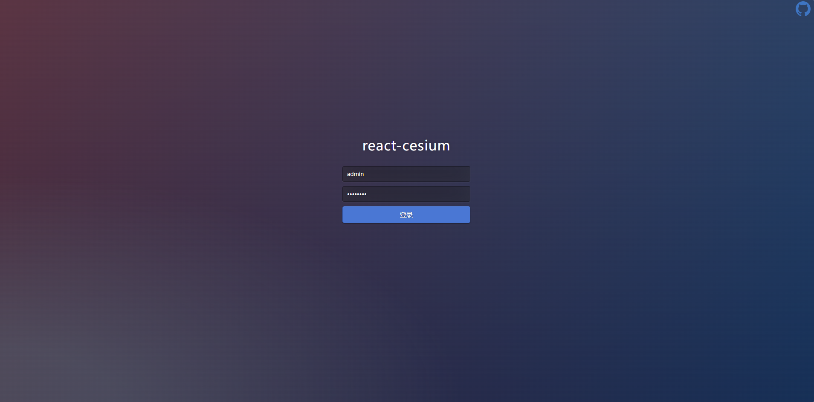

# react-cesium

使用最新 react@18.3.1、webpack@5.64.4、redux@5.0.1、react-router-dom@6.25.1搭建一个 react 的后台管理系统，
整合cesium@1.119.0、three@0.167.0 三维框架，引入cesium_dev_kit@1.0.91开发工具包，编写案例测试所以功能

# Preview

[在线地址 https://benpaodehenji.com/reactCesium/](https://benpaodehenji.com/reactCesium/)

- 登录
  
- 功能预览
  

# install dependencies

```
npm i
// OR
 yarn

```

如果 npm 安装过慢建议使用淘宝镜像

```
npm config get registry

# 设置为淘宝镜像
npm config set registry https://registry.npmmirror.com

# 设置为官方镜像
npm config set registry https://registry.npmjs.org
```

# test

```
npm run test
//OR
 yarn run test
```

# dev

```
npm start
// OR
 yarn run start
```

**注意：setupProxy.js 中 const originUrl ='http://\*\*\*\*:9527/reactCesium' 需要改成自己本机的 ip 地址**

# build

```
npm run build
//OR
yarn run build

```

# Source address

[https://github.com/dengxiaoning/cesium_dev_kit](https://github.com/dengxiaoning/cesium_dev_kit)

# env

```
  "engines": {
    "node": ">=18.17.0",
    "npm": ">=8.19.4",
    "yarn":">=1.22.19"
  }
```
